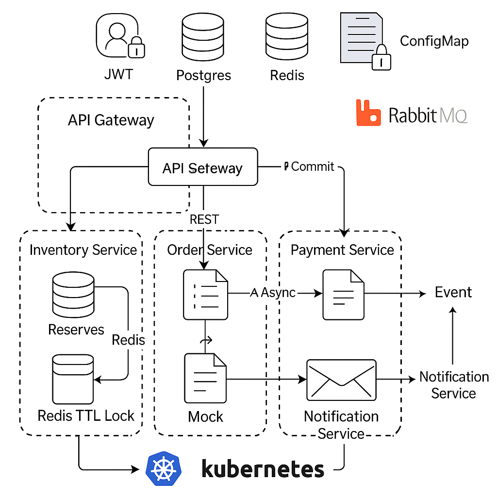

# RuhuTickets — Cloud-Native Ticket Booking

A **cloud-native event ticket booking platform** implemented with microservices.  
This project demonstrates **scalability, high availability, security, modern deployment, and async communication** using Kubernetes and Docker.

# Cloud Architecture

---

## Quick Start (Docker — Local Dev)

### 1. Run services
```bash
cp .env.example .env
docker compose -f deploy/compose/docker-compose.yaml up -d --build

# Run DB migrations & seed
docker compose -f deploy/compose/docker-compose.yaml exec inventory npm run db:migrate  
docker compose -f deploy/compose/docker-compose.yaml exec inventory npm run db:seed

# Try APIs
curl -s http://localhost:8080/health
curl -s http://localhost:8080/api/v1/events

```
Then open RabbitMQ UI at http://localhost:15672 (guest/guest).

## Quick Start (Kubernetes — Kind)

### 1. Create cluster
kind create cluster --name ruhu
kubectl cluster-info --context kind-ruhu

### 2. Deploy base infra
kubectl apply -f deploy/k8s/base/00-namespace.yaml
kubectl -n ruhutickets apply -f deploy/k8s/base/10-postgres.yaml
kubectl -n ruhutickets apply -f deploy/k8s/base/11-redis.yaml
kubectl -n ruhutickets apply -f deploy/k8s/base/12-rabbitmq.yaml
kubectl -n ruhutickets apply -f deploy/k8s/base/20-services.yaml

### 3. Add config + secrets
kubectl -n ruhutickets create configmap app-config \
  --from-literal=JWT_SECRET=dev-secret \
  --from-literal=JWT_ISS=ruhutickets \
  --from-literal=JWT_AUD=ruhutickets-ui \
  --from-literal=POSTGRES_HOST=postgres \
  --from-literal=POSTGRES_DB=ruhu \
  --from-literal=POSTGRES_USER=postgres \
  --from-literal=REDIS_HOST=redis \
  --from-literal=REDIS_PORT=6379 \
  --from-literal=RABBITMQ_URL=amqp://rabbitmq:5672

kubectl -n ruhutickets create secret generic app-secrets \
  --from-literal=POSTGRES_PASSWORD=postgres


### 4. Ingress setup
kubectl apply -f deploy/k8s/base/ingress-nginx-kind.yaml
kubectl -n ruhutickets apply -f deploy/k8s/base/30-ingress.yaml
kubectl -n ingress-nginx port-forward svc/ingress-nginx 18080:80

Edit your hosts file:
127.0.0.1 ruhutickets.local

App UI 👉 http://ruhutickets.local/login.html

Health check:
curl -i -H "Host: ruhutickets.local" http://127.0.0.1:18080/health


## Services
- **api-gateway**: edge routing, JWT auth, CORS, rate limiting
- **inventory**: events, ticket types, reservations (Redis lock + Postgres authoritative state)
- **order**: saga orchestration (reservations → commit → payment)
- **payment**: mock payment API (idempotent), webhook endpoint
- **notification**: consumes RabbitMQ events, simulates “email” delivery

## Tech Stack
- Runtime: Node.js (Express + Zod)
- Datastores: PostgreSQL, Redis
- Messaging: RabbitMQ
- Infra: Docker, Kubernetes (Kind), Ingress-Nginx
- Deployment: ConfigMaps, Secrets, Horizontal Pod Autoscaler (HPA)
- Security: JWT, role-based auth, Helmet, CORS

## Cloud-Native Features
- Scalability: Horizontal Pod Autoscaler (40-hpa.yaml) → scales each service (2–5 replicas) on CPU load.
- High Availability: Multi-replica deployments + resilient state (Redis TTL + Postgres).
- Security: RabbitMQJWT authentication, secrets for DB credentials, hardened headers.
- Communication: REST (sync) + RabbitMQ events (async).
- Resilience: Reservation expiry, schema migration (e.g. created_at fix in reservations).
